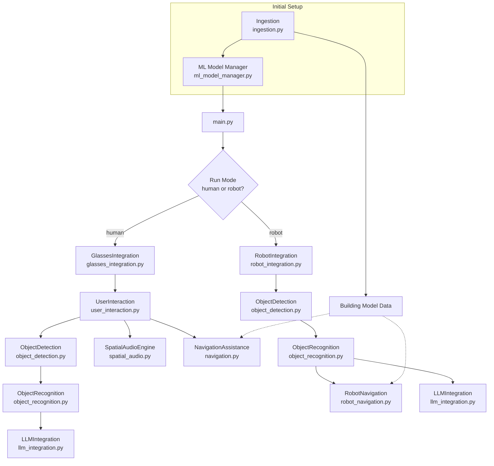

# System Architecture Diagram

Below is a Mermaid diagram representing the high-level flow of data and control
across the **SmartAR-3D-Robot-Explorer** framework. It shows how the system
initializes, loads the 3D building model, sets up machine learning models, and
then branches into **human** or **robot** mode.

