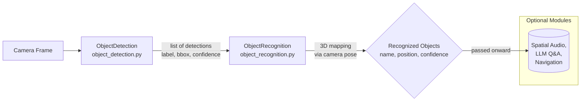

# Detection Pipeline Diagram

Below is a Mermaid diagram that illustrates the data flow in the **object detection**
and **recognition** pipeline within **SmartAR-3D-Robot-Explorer**.

```mermaid
flowchart LR
    A[Camera Frame] --> B[ObjectDetection<br>object_detection.py]
    B -->|list of detections<br>label, bbox, confidence| C[ObjectRecognition<br>object_recognition.py]
    C -->|3D mapping<br>via camera pose| D{Recognized Objects<br>name, position, confidence}
    D -->|passed onward| E[...modules...]
    E[(Spatial Audio,<br>LLM Q&A,<br>Navigation)]
    
    subgraph "Optional Modules"
        E
    end

```
